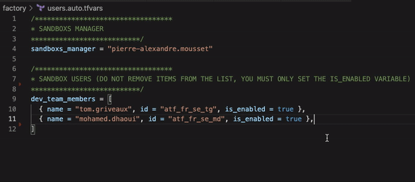

<h1 align="center">
  AWS-IAC Factory 🏭 ☁️
</h1>


<div align="center">


[](https://github.com/artefactory/aws-iac-factory/actions/workflows/build.yml)


**Aws-iac-factory** is a project to create, delete and manage Amazon Web Services (AWS) sandboxs easily using Terraform.


</div>


## Background

Artefact uses AWS Organizations to manage multiple AWS accounts, including developer sandbox accounts (member accounts) that can be used to learn, experiment, and deploy resources. All billing is managed by the Artefact Main account. This Main account also applies some policies applied to member accounts. 

## Installation 

### Prerequisite

1) clone the repository 
```
git clone git@github.com:artefactory/aws-iac-factory.git
```
<br />

2) export AWS credentials on your project (every AWS sandbox manager must have credentials)
```
$ export AWS_ACCESS_KEY_ID="anaccesskey"
$ export AWS_SECRET_ACCESS_KEY="asecretkey" 
```
<br />

3) initialize a local working directory containing Terraform configuration files
```
$ make init 
```
*You are now all set!


### Adding a new user 



### Removing a user


## Project Organization

```
.
├── Makefile
├── README.md
├── docs
└── factory
    ├── backend.tf
    ├── bootstrap
    │   ├── backend.tf
    │   ├── providers.tf
    │   ├── variables.tf
    │   └── versions.tf
    ├── main.tf
    ├── modules
    │   ├── accounts
    │   │   ├── locals.tf
    │   │   ├── main.tf
    │   │   ├── outputs.tf
    │   │   └── variables.tf
    │   ├── organizations
    │   │   ├── main.tf
    │   │   ├── outputs.tf
    │   │   └── variables.tf
    │   └── users
    │       ├── main.tf
    │       └── variables.tf
    ├── providers.tf
    ├── secrets.auto.tfvars
    ├── users.auto.tfvars
    ├── variables.tf
    └── versions.tf
```

## Q&A

### Why do we have to set is_enabled to false in order to remove a user? Can't we just remove that line from the ```users.auto.tfvars``` file? 

According to [Terraform documentation](https://registry.terraform.io/providers/hashicorp/aws/latest/docs/resources/organizations_account), *Deleting this Terraform resource will only remove an AWS account from an organization. Terraform will not close the account. The member account must be prepared to be a standalone account beforehand. See the AWS Organizations documentation for more information.*




